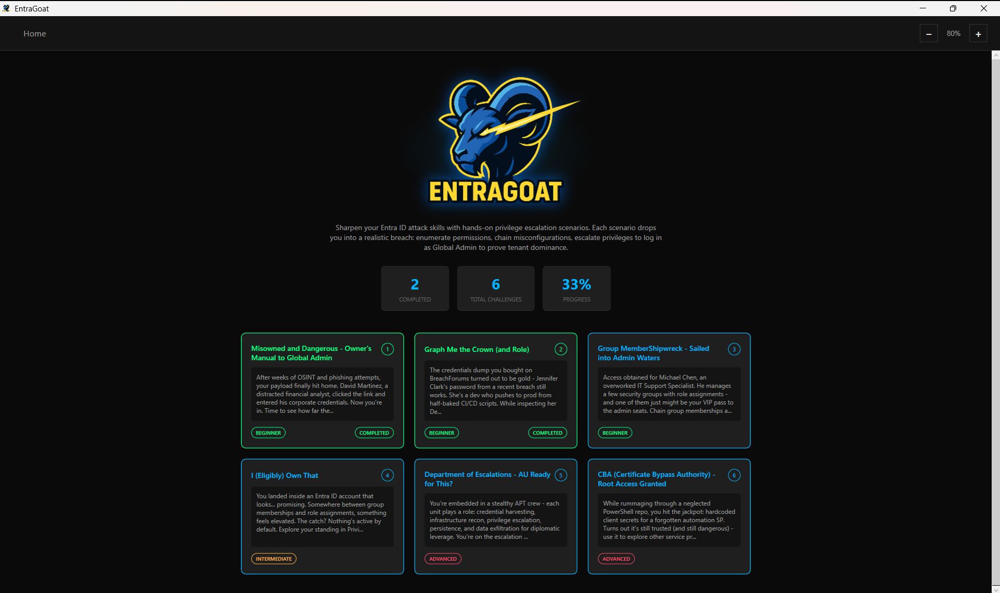
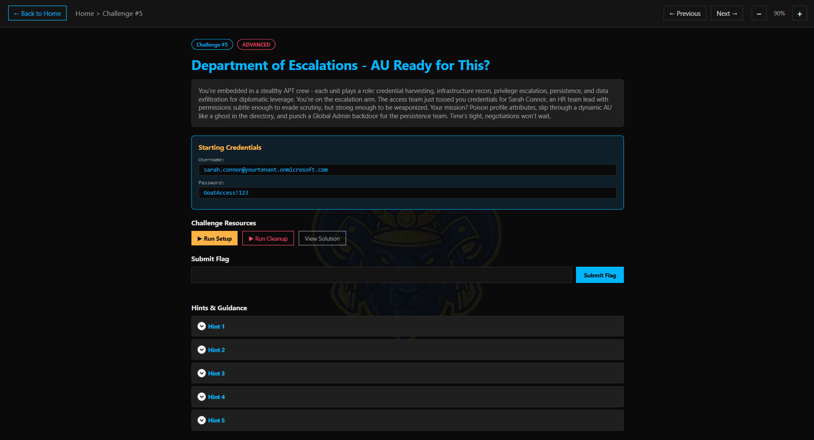
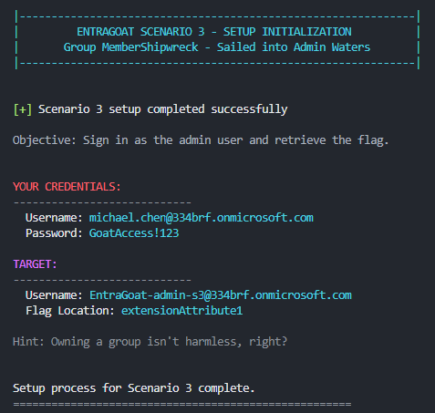
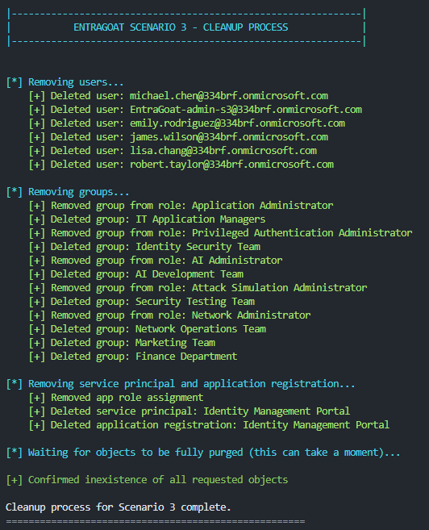

# EntraGoat - A Deliberately Vulnerable Entra ID Environment

<p align="center">
  
</p>

**EntraGoat** is a deliberately vulnerable Microsoft Entra ID infrastructure for security professionals. Deploy real-world identity misconfigurations and privilege escalation paths in your own tenant, then practice exploiting them in a safe, black-box CTF format.

📖 [Documentation](./docs/) &nbsp;|&nbsp; 📝 [Blog Posts](https://www.semperis.com/blog/what-is-entragoat-entra-id-simulation-environment/)

---

## Quick Start

### Prerequisites

- Microsoft Entra ID **test/trial tenant** with Global Administrator
- [Microsoft Graph PowerShell SDK](https://learn.microsoft.com/en-us/powershell/microsoftgraph/installation)

### Option A: PowerShell GUI *(recommended, no Node.js)*

```powershell
git clone https://github.com/Semperis/EntraGoat && cd EntraGoat
Install-Module Microsoft.Graph -Scope CurrentUser -Force
.\Start-EntraGoat.ps1
```

> Requires Windows (WPF). Works on PowerShell 5.1+ and 7+.  
> Zoom: **Ctrl+Plus** / **Ctrl+Minus** / **Ctrl+0**

### Option B: Web UI

```bash
git clone https://github.com/Semperis/EntraGoat && cd EntraGoat
Install-Module Microsoft.Graph -Scope CurrentUser -Force
cd frontend && npm install && npm start
```

Open `http://localhost:3000`

### Option C: Manual scripts

```powershell
cd scenarios
.\EntraGoat-Scenario1-Setup.ps1
```

> See [docs/getting-started.md](./docs/getting-started.md) for detailed setup instructions.

---

## Challenges

| # | Name | Difficulty |
|---|------|-----------|
| 1 | Misowned and Dangerous — Owner's Manual to Global Admin | Beginner |
| 2 | Graph Me the Crown (and Role) | Beginner |
| 3 | Group MemberShipwreck — Sailed into Admin Waters | Beginner |
| 4 | I (Eligibly) Own That | Intermediate |
| 5 | Department of Escalations - AU Ready for This? | Advanced |
| 6 | CBA (Certificate Bypass Authority) - Root Access Granted | Advanced |

Each scenario includes a setup script, cleanup script, solution walkthrough, and a hidden flag.

---

## Screenshots

### PowerShell GUI *(recommended)*

| Home |
|:-:|
|  |

| Challenge |
|:-:|
|  |


### Terminal Output

| Setup | Cleanup |
|:-:|:-:|
|  |  |

### Web UI *(alternative)*

| Dashboard | Challenge |
|:-:|:-:|
|  |  |

---

## Presented at

- **Black Hat USA 2025** — Arsenal
- **DEF CON 33** — Demo Labs
- **BSides Frankfurt 2025** 
- **SEC-T 0x11** 
- **Black Hat SecTor 2025** — Arsenal
- **Black Hat Europe 2025** — Arsenal
- **Black Hat Asia 2026** — Arsenal


## Resources

- [What Is EntraGoat?](https://www.semperis.com/blog/what-is-entragoat-entra-id-simulation-environment/)
- [Getting Started with EntraGoat](https://www.semperis.com/blog/getting-started-with-entragoat-entra-id-simulation-lab/)
- [Scenario 1: Service Principal Ownership Abuse](https://www.semperis.com/blog/service-principal-ownership-abuse-in-entra-id/)
- [Scenario 2: Exploiting App-Only Graph Permissions](https://www.semperis.com/blog/exploiting-app-only-graph-permissions-in-entra-id/)
- [Scenario 6: Certificate-Based Authentication Abuse](https://www.semperis.com/blog/exploiting-certificate-based-authentication-in-entra-id/)

---

## ⚠️ Disclaimer

**For educational and authorized testing only.** Use a dedicated test tenant. See [LICENSE](./LICENSE) for full terms. The authors assume no liability for misuse.

---

**Happy Hunting!** — The EntraGoat Team
